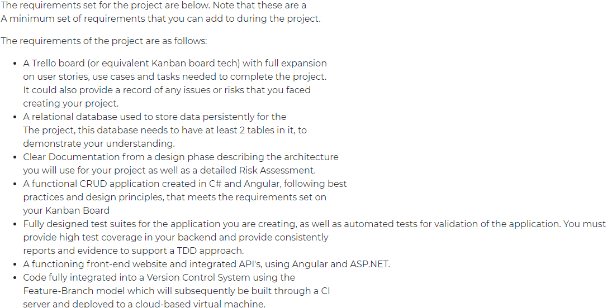

# README

# Avanade Fundamental Project

This readme file serves as my documentation for the Avanade fundamental project I worked on. 

The object of the project is to:

- create a CRUD application with the utilisation of supporting tools,methodologies and technologies that encapsulate all core modules covered during training.

The idea for the project can be a business case, such as a library or supermarket system, or something to do with a hobby of yours.

This is purposefully open to endorse creativity and allow us to do a project that we have full command over. It is in our interest do something we are passionate about, as experience has shown these to be the best projects.

# Scientia Bookstore Management System

---

# Content

---

# Introduction

Every step of the software development cycle responsible for making Scientia possible is detailed within this document. Scientia is a bookstore management system, deployed as a web application, that aides bookstores in managing their catalogue of items. It enables the adding and deleting of books from the bookstore's database. Furthermore, it ensures bookstores are able to update any of their book's information be it the published date, author, number of copies etc.

# Requirement

There were a  list of requirements the project  had to adhere to. This is in the image below

From the requirements, I determine what the minimum viable version of my application would be and how it satisfies the CRUD requirements provided above. See the bullet list for the details. The application must:

- `provide a view of the entirety of the booskstore's catalogue of books` - This satisfies the "read" portion of the crud requirement
- `enable the addition of books to the bookstore's catalogue` - This satisfies the "create" portion of the crud requirement
- `enable the deletion of books from the bookstore's catalogue` - This satisfies the "delete" portion of the crud requirement
- `enable the updating of books in the bookstore's catalogue` - This satisfies the "update" portion of the crud requirement

Ideally, interviews or surveys will be conducted to understand what a bookstore manager would need need from a bookstore management system. However, due to time constraints, I played the role of this stakeholder. A Trello board was created to make tracking of these features and managing the project easy.

# Risk Assessment

The risk assessment matrix below describes the potential risks identified throughout the life of the project. In addition to each risk, It also includes the likelihood of the said risk happening, the severity of the risk if it does happen and the measure put in place to control the impact of the risk. A revisit column was added to ensure that each risk is re-evaluated continuously throughout the project and importantly in light of the current state of the project at the time of evaluation. 

# Architecture, Design and Tools

An MVC software design pattern was used in building Scientia. The "M" in MVC stands for model and the app's model was defined in using C# using. The project used a MySQL database and it was created by employing a code-first development approach through the use of Entity Framework. "V" refers to view which is the front-end of the application. Scientia's front end was built using the Angular framework which comprises of HTML+CSS for structuring and styling the app's webpage, and Typescript for writing the views logic. The "C" refers to the controller and it takes requests from the front-end and serves it to the back-end, and also takes results/responses from the back-end and serves it to the front-end to display. The controller implemented for this project was a .NET Web API written in C#.

## Model - Database's Entity Relationship Diagram

The image above shows the entity relationship diagram (ERD) for the database required by the mvp version of the application. Within each entity which maps to a table within the database, the diagram shows which field is the primary key (denoted by "PK"), it shows all the fields in the table, and lastly, the type of data stored for each field. In addition, the ERD shows the most important feature of all, the relationship between entities/tables. The relationship from the book to the author entity is one-to-one. This means the a book can only belong to a single author and a single author only. However, the relationship from author to the book is that of a many-to-one. This means that the author can author many books. This model is indeed simplified as in the real world the relationship describe is not so, however it forms a good base to have a minimum viable version of my application built on top.

## Controller - .Net Web API

A .Net 5 Web API app was used as the controlller for Scientia and it handled the http requests required to ensure the application can carry out all the required crud operations. 

For the Book model the controller is able to handle:

- GET requests - read
- POST requests - create
- PUT requests - update
- DELETE requests - delete

For the Author model the controller is designed to handle only GET, PUT and DELETE,  and this is because Scientia was designed in a way that a book must have an author. Therefore, when a book is created, the author detail must also be provided and the author is created along with the book. Similarly, an author connected to a book cannot be deleted which is consistent with the desired between an author and a book.

## View

The Application's front UI was built using a front-end framework called Angular and some additional libraries with angular material bootstrap being an important one.

# Aside Points

- Did not include an "In-Review" sections because I was the only one working on the project. Within a larger team an in-review section will makes sense.
- Did not have Epics because the scope of the project was big enough to requirements that encapsulated a wide breadth of user stories.